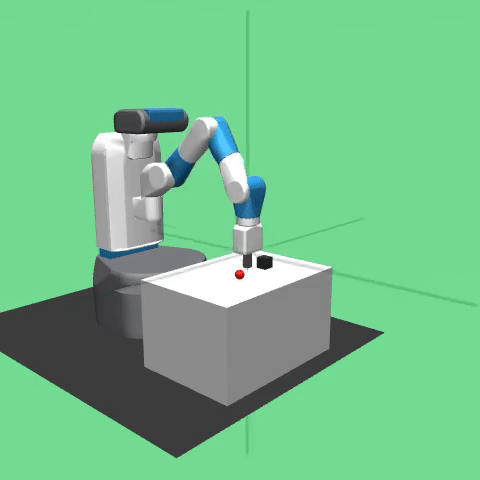

# Fetch Mobile Manipulator

## Fetch Push

## Fetch Slide

## Fetch Pick and Place

## Fetch Reach

## Results

Hardware: Google Colab L4

| Environment    | Model Type | Average Reward | Total Training Steps | HuggingFace                                                     |
|----------------|------------|----------------|----------------------|-----------------------------------------------------------------|
| Reach          | TQC        | -0.59          | 1,000,000            | [Link](https://huggingface.co/kuds/fetch-reach-dense-tqc)       |
| Reach          | DDPG       | -0.65          | 1,000,000            | [Link](https://huggingface.co/kuds/fetch-reach-dense-ddpg)      |
| Push           | TQC        | -2.02          | 1,000,000            | [Link](https://huggingface.co/kuds/fetch-push-dense-tqc)        | 
| Slide          | TQC        | -6.90          | 1,000,000            |                                                                 | 
| Pick and Place | TQC        | -2.07          | 1,000,000            | [Link](https://huggingface.co/kuds/fetch-pick-place-dense-tqc)  |
| Pick and Place | DDPG       | -11.01         | 1,000,000            | [Link](https://huggingface.co/kuds/fetch-pick-place-dense-ddpg) |

## Training Notes
- Set `learning_starts` needs to be greater than 100 as the Fetch environment are defaulted to end at 50 steps (`max_episode_steps=50`) and this will cause for TQC
- Due to overestimation issues with DDPG, it will struggle in more complex environment like in Pick & Place and Slide. So it is excepted for DDPG struggle to "solve" the Fetch environments

## Finding Theta Blog Posts
- [Mastering Robotic Manipulation with Reinforcement Learning: TQC and DDPG for Fetch Environments](https://www.findingtheta.com/blog/mastering-robotic-manipulation-with-reinforcement-learning-tqc-and-ddpg-for-fetch-environments)
