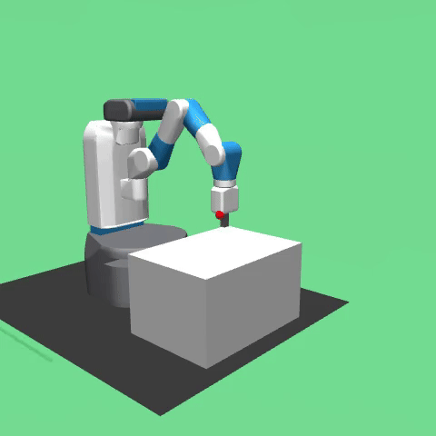

# Fetch Mobile Manipulator

## Fetch Push

## Fetch Slide

## Fetch Pick and Place

## Fetch Reach

## Results

Hardware: Google Colab T4

| Environment    | Model Type | Average Reward | Training Time | Total Training Steps |
|----------------|------------|----------------|---------------|----------------------|
| Reach          | TQC        | -0.47          | 4:53:16       | 499,999              |
| Reach          | DDPG       | -0.57          | 2:10:28       | 499,996              |
| Push           | TQC        | -3.02          | 10:02:34      | 1,000,000            |
| Slide          | TQC        | -6.90          | 9:44:20       | 1,000,000            |
| Pick and Place | TQC        | -1.98          | 9:49:33       | 999,997              |

## Training Notes

## Finding Theta Blog Posts: 
- [Mastering Robotic Manipulation with Reinforcement Learning: TQC and DDPG for Fetch Environments](https://www.findingtheta.com/blog/mastering-robotic-manipulation-with-reinforcement-learning-tqc-and-ddpg-for-fetch-environments)

